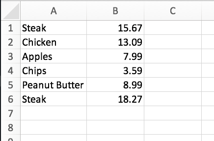

# ShoppingHelper
ShoppingHelper is a tool that helps you estimate how much you will spend when you go shopping. I originally came up with this idea as a poor college student trying to figure out what I can afford to buy on a specific week for groceries. ShoppingHelper does this by having you input items and how much you paid for them. Each item holds an average, minimum and maximum price. When you add items to a shopping you list, it will tally up the total price for all of the items and ask you if you want to see what the list would cost going by the items' average, maximum, or minimum prices.

##Data Input
ShoppingHelper collects its data from the user inputting the name of a .xlsx file. The file should be set up so that the name of the item is in column A and the price is in columb B. For example:
